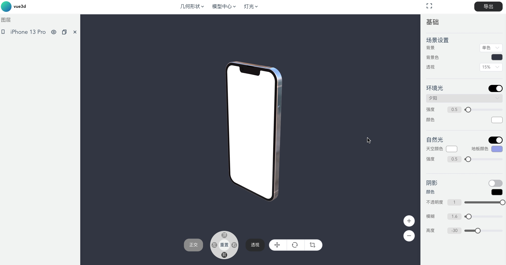
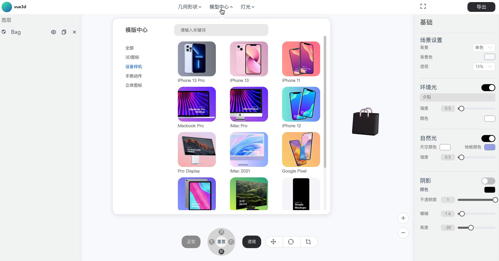
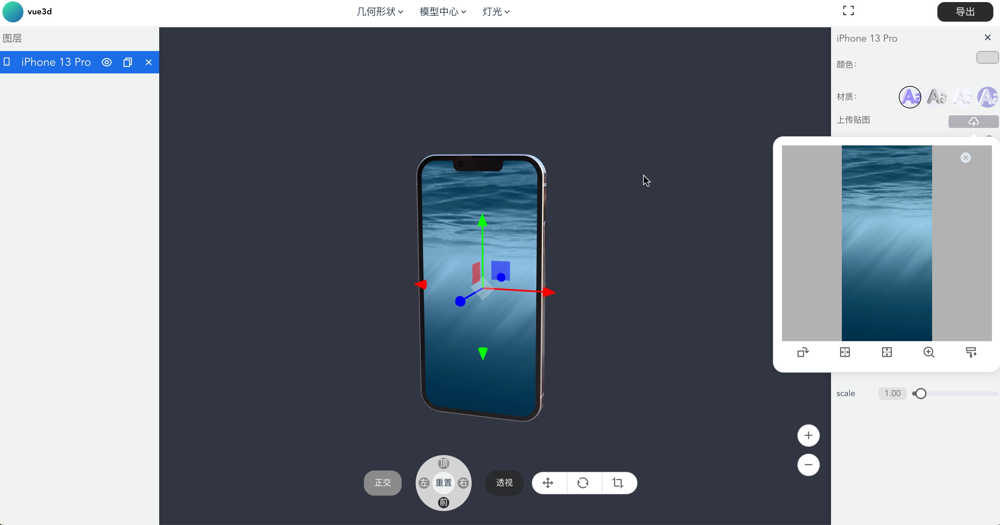
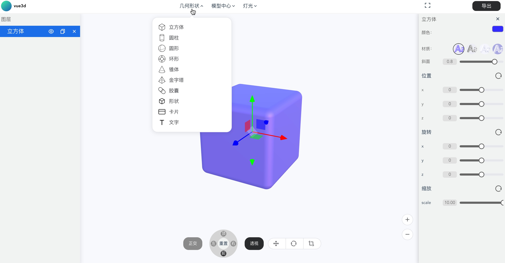
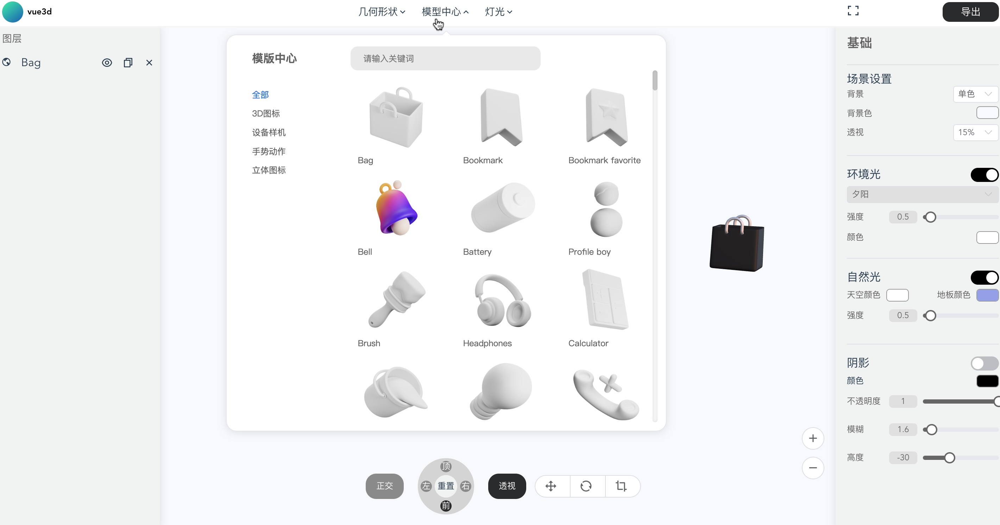
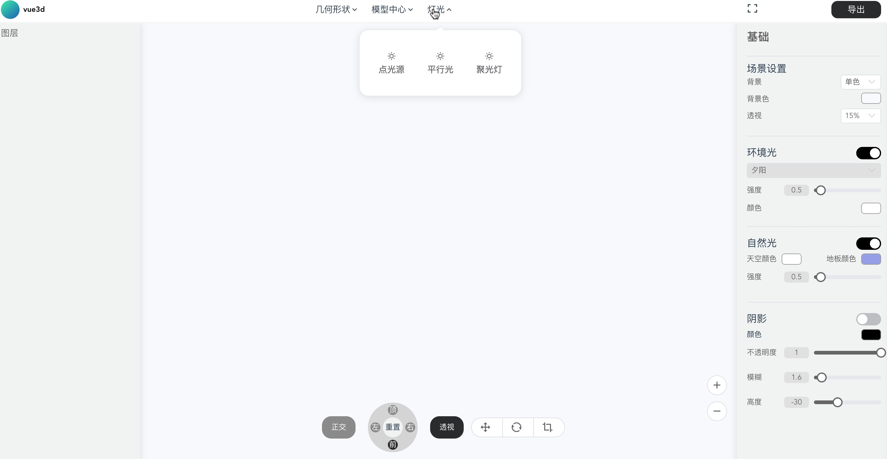

# vue-three-3D

一个基于 Vue3 和 Three.js 的 3D 模型查看与编辑项目，集成了丰富的 3D 功能，帮助您轻松实现 3D 模型的可视化和交互操作。

#### 项目依赖

- Vue 3 - JavaScript 框架
- Vue Router - 路由管理
- Vuex - 状态管理
- Three.js - 3D 渲染库
- Element Plus - UI 组件库
- Axios - HTTP 请求库

#### 核心功能

- 3D 模型查看：旋转、缩放等基础操作
- 3D 模型编辑：支持基本编辑
- 模型导出：将 3D 模型导出为图片
- 贴图：自定义模型贴图材质
- 场景灯光与阴影：逼真的光影效果

### 设备模型查看、贴图




### 几何形状

### 3d物料、灯光


## 快速开始：

### 安装依赖

```
npm install
```

### 运行

```
npm run serve
```

### 欢迎查看我的新项目微信小程序，内置很多好玩的功能

小绿狗丨社恐来电聊天模拟器

